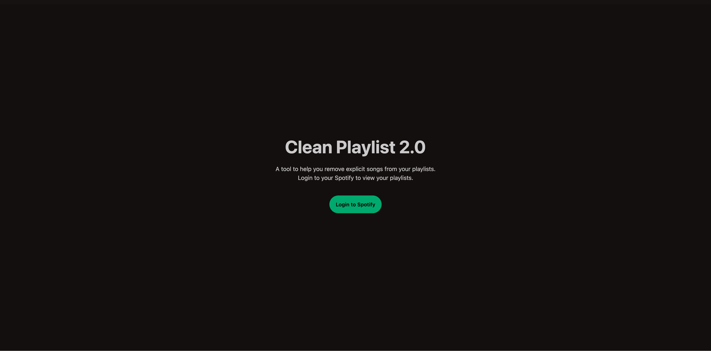
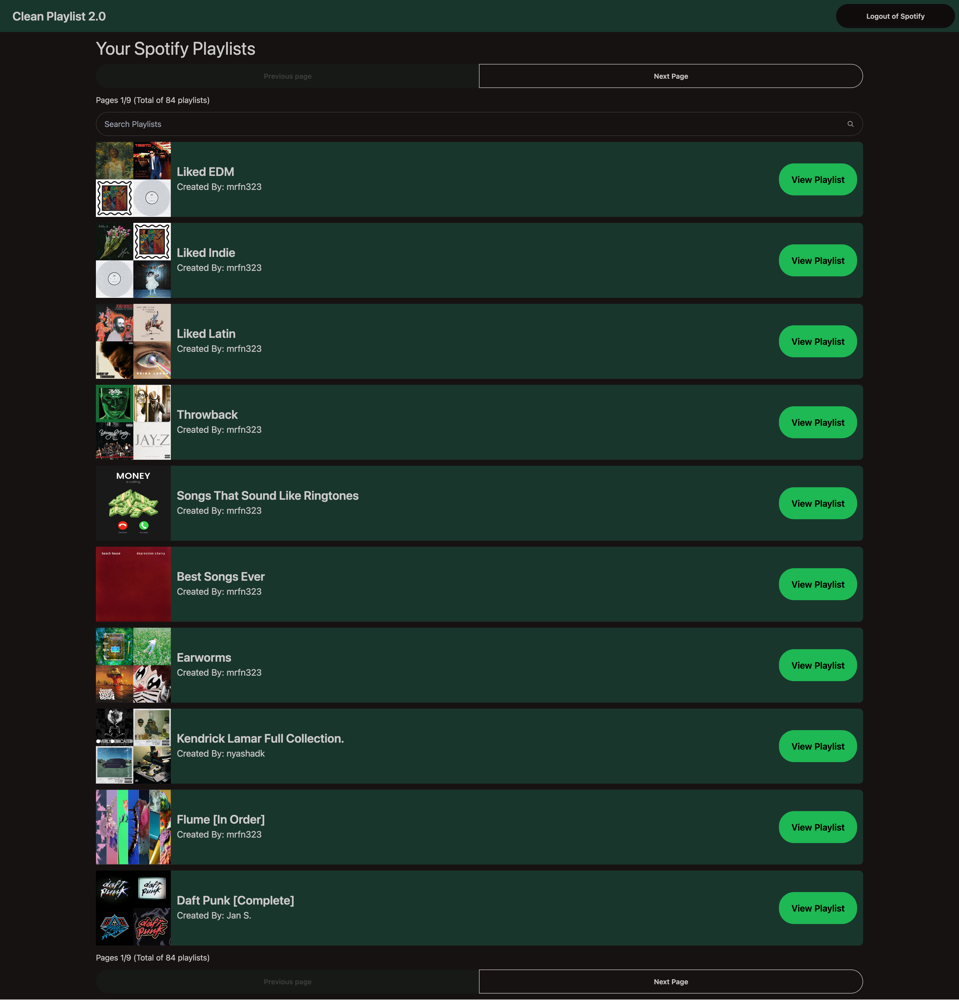
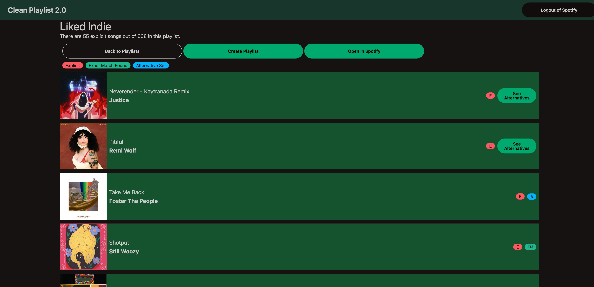
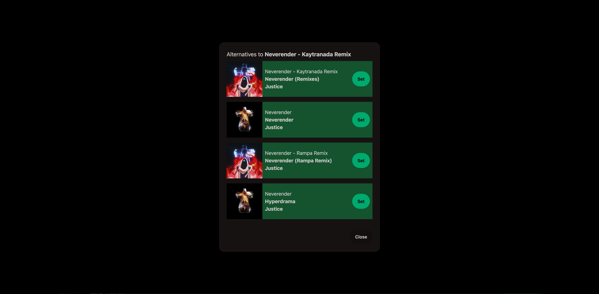

#  Clean-Playlist 2.0

A tool that removes or replaces explicit songs from a Spotify playlist!

 




## Background
This is an application that I had originally developed with the intetions of self hosting and making publicly accessible. After 2 failed spotify application reviews and [the stricter Web API guidelines](https://developer.spotify.com/blog/2025-04-15-updating-the-criteria-for-web-api-extended-access) since I started, I have decided to make this open source and easily self hostable. This is a tool I have been using to make it easier to play music in the car or settings where it would be uncomfortable to play explicit songs. I plan on maintaining this application to the best of my ability and am open to implementing new features.

## Links
Backend Repo: https://github.com/sfn-git/clean-playlist-2-backend \
Frontend Repo: https://github.com/sfn-git/clean-playlist-2-frontend

## Requirements
- A domain name and the ability to serve the application using HTTPs. This is due to stricter requirements from Spotify's API. I have not yet tested local ips to the point of creating documentation for it but I will add that in the future.
- Spotify account with some playlists added. The playlist do not need to be your but you need to add them to your library.
- Spotify Developer Account Setup
    - Go to https://developer.spotify.com/ and login with your Spotify account
    - After logging in, navigate to https://developer.spotify.com/dashboard
    - Click "Create app"
        - Enter the required details
        - For Redirect URIs `https://backendurl/spotify/auth/callback/`
        - Check the `Web API` under "Which API/SDKs are you planning to use?"
        - Click Save
        - Refer back to the application you created when needing to access the Client ID and Secret.

## Configuration
- Backend Environment Variables
    - SPOTIFY_CLIENT_ID - Spotify Client ID from Spotify Developer Dashboard
    - SPOTIFY_CLIENT_SECRET - Spotify Secret from Spotify Developer Dashboard
    - APP_BASE_URL - Base URL of the backend application. Example `https://backend.com`
    - APP_BASE_DOMAIN - Base domain of the backend application. Example `backend.com`        
    - FRONTEND_URL - Where the application redirects to after spotify authentication. Example `https://frontend.com`
    - ENV - Set to `prod` when running for non-development purposes (`dev/prod`)
- Frontend Enviroment Variable
    - VITE_API_URL - Base URL of the backend application. You can use the value set in `APP_BASE_URL`

## Installation
- Docker Compose
    - Copy the [docker-compose.yaml](https://raw.githubusercontent.com/sfn-git/clean-playlist-2/refs/heads/main/docker-compose.yaml) file and adjust the variables as needed. [See Configuration](#configuration)
- Docker Run
    - Backend 
    ```
    docker run \
        -p 8080:8080 \
        -e SPOTIFY_CLIENT_ID='' \
        -e SPOTIFY_CLIENT_SECRET='' \
        -e APP_BASE_URL='' \
        -e APP_BASE_DOMAIN='' \
        -e FRONTEND_URL='' \
        -e ENV='' \
        --name clean-playlist-backend \
        ghcr.io/sfn-git/clean-playlist-2-backend:main
    ```
    - Frontend
    ```
    docker run \
        -p 8081:8080 \
        -e VITE_API_URL='' \
        --name clean-playlist-frontend \
        ghcr.io/sfn-git/clean-playlist-2-frontend:main
    ```
